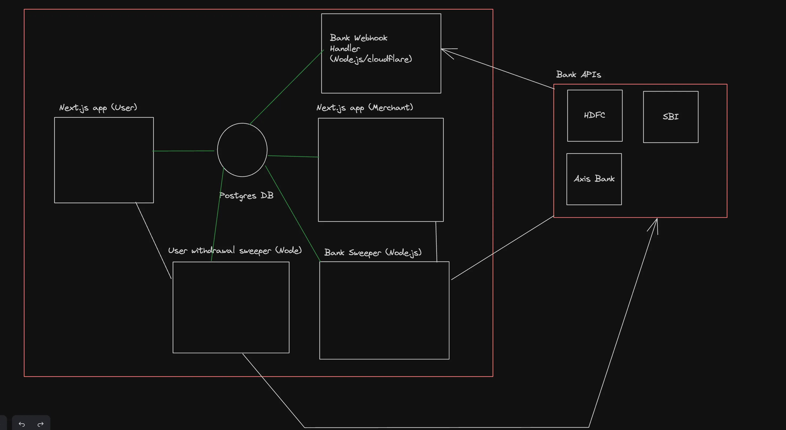

# Stash

Stash is a full-stack digital wallet application built using Next.js, designed to replicate and simplify the seamless experience of popular wallet platforms like `PayTM`. The platform enables users to add fake money to their wallet, send funds to others, and receive payments from other fellow users.

The app focuses on delivering an intuitive user interface, fast transactions, and robust backend support for handling wallet balances and transaction histories. Users can view their wallet balance in real-time, track past transactions, and initiate peer-to-peer transfers with ease.

##

### Architecture :

##

### Features :

1. Auth (In this case, probably email/phone).
2. Send money to someone.
3. Support transfers via phone number/name.
4. Withdraw balance of user back to bank
5. Webhooks from banks to transfer in money

##

### Tech Stack :

- Frontend and Backend - Next.js (or Backend)
- Tailwind (Styling)
- Express - Auxiliary backends
- Turbo-repo
- Postgres Database
- Prisma ORM
